# Escopo do Projeto Mega_Emu

## Visão Geral

O Mega_Emu é um emulador multi-plataforma de código aberto projetado para fornecer emulação precisa de consoles retro, incluindo Mega Drive/Genesis, NES, SNES e Master System. O projeto foca em precisão, desempenho e usabilidade, oferecendo uma experiência completa tanto para jogadores quanto para desenvolvedores.

## Objetivos Funcionais

1. **Emulação Precisa**
   - Implementar emulação ciclo-a-ciclo das CPUs originais
   - Reproduzir comportamentos de hardware específicos de cada console
   - Garantir compatibilidade com a maioria das ROMs comerciais

2. **Interface Intuitiva**
   - Fornecer uma GUI moderna e responsiva
   - Suportar configurações personalizáveis para vídeo e áudio
   - Implementar recursos de acessibilidade

3. **Ferramentas de Desenvolvimento**
   - Incluir debuggers para cada plataforma emulada
   - Oferecer visualizadores de memória, VRAM e registradores
   - Fornecer ferramentas para análise de desempenho e profiling
   - Implementar suite completa de ferramentas de desenvolvimento visual

4. **Multi-plataforma**
   - Suportar Windows, Linux e macOS
   - Adaptar para diferentes arquiteturas (x86, ARM)
   - Garantir consistência entre plataformas
   - Suporte a dispositivos móveis e consoles modernos

## Arquitetura

A arquitetura do Mega_Emu segue um design modular estruturado em camadas:

```mermaid
graph TD
    A[Frontend/GUI] --> B[Core]
    B --> C[Platform Implementations]
    C --> D1[NES]
    C --> D2[SNES]
    C --> D3[Mega Drive]
    C --> D4[Master System]
    C --> D5[Atari 7800]
    C --> D6[ColecoVision]
    C --> D7[Game Boy]
    C --> D8[Atari Lynx]
    C --> D9[TurboGrafx-16]
    C --> D10[Neo Geo AES]
    C --> D11[Game Boy Color]
    C --> D12[PlayStation]
    C --> D13[Sega Saturn]
    C --> D14[Atari Jaguar]
    C --> D15[3DO]
    C --> D16[Nintendo 64]
    C --> D17[Dreamcast]
    C --> D18[PcEngine]
    C --> D19[Game Boy Advenced]
    B --> E[Hardware Abstraction]
    E --> F1[Video]
    E --> F2[Audio]
    E --> F3[Input]
    E --> F4[State Management]
    A --> G[Development Tools]
    G --> T1[Sprite Viewer]
    G --> T2[Dev Art Tools]
    G --> T3[Dev Editor]
    G --> T4[Event Viewer]
    G --> T5[Memory Viewer]
    G --> T6[Node IDE]
    G --> T7[Sound Monitor]
    G --> T8[Dev Tools Suite]
```

### Camadas Principais

1. **Core**
   - Gerencia o ciclo de vida do emulador
   - Fornece APIs comuns para todas as plataformas
   - Implementa serviços compartilhados

2. **Platforms**
   - Contém implementações específicas para cada console
   - Cada plataforma encapsula CPUs, PPUs e hardware de áudio
   - Gerencia características únicas de cada console

3. **Frontend**
   - Interface gráfica baseada em SDL2
   - Renderizadores de vídeo e áudio
   - Gerenciamento de entrada
   - Interfaces específicas para cada plataforma
   - Suporte a diferentes tipos de dispositivos (desktop, mobile, consoles)

4. **Utils**
   - Funções utilitárias compartilhadas
   - Logging e diagnósticos
   - Gerenciamento de configuração

5. **Development Tools**
   - Suite integrada de ferramentas para desenvolvimento e análise
   - Visualizadores e editores especializados
   - Ferramentas de debugging avançadas
   - Sistema extensível via plugins

## Ferramentas de Desenvolvimento

O Mega_Emu inclui um conjunto abrangente de ferramentas de desenvolvimento que serão implementadas como parte do projeto:

### Ferramentas Visuais

1. **Sprite Viewer**
   - Visualização em tempo real de todos os sprites no VRAM
   - Extração automática de paletas
   - Exportação em formatos modernos (PNG, GIF, etc.)
   - Visualização de animações de sprites
   - Integração com VRAM em tempo real
   - Suporte a diferentes formatos específicos de cada plataforma

2. **Dev Art Tools**
   - Editor de paletas com suporte a restrições de hardware
   - Editor de tiles/patterns para criação gráfica
   - Ferramentas de conversão entre formatos gráficos
   - Preview em tempo real no emulador
   - Importação/exportação de recursos gráficos
   - Suporte a diferentes modos gráficos

3. **Dev Editor**
   - Editor de código assembly integrado
   - Suporte a diferentes arquiteturas de CPU
   - Montagem em tempo real e injeção no emulador
   - Destaque de sintaxe específico para cada plataforma
   - Integração com ferramentas de debugging
   - Wizards para operações comuns

4. **Event Viewer**
   - Visualização de timeline de eventos do sistema
   - Filtragem por tipos de eventos (interrupções, DMA, etc.)
   - Análise de timings e performance
   - Exportação de logs de eventos
   - Triggers de breakpoints baseados em eventos
   - Visualização gráfica de eventos paralelos

5. **Memory Viewer**
   - Visualização avançada de todas as regiões de memória
   - Edição em tempo real de valores na memória
   - Diferentes formatos de visualização (hex, decimal, ASCII, etc.)
   - Histórico de alterações e comparação
   - Bookmarks e anotações
   - Busca avançada com suporte a padrões

6. **Node IDE**
   - Sistema visual de programação baseado em nodos
   - Criação de scripts e automações sem código tradicional
   - Biblioteca de nodos para manipulação de hardware emulado
   - Integração com debugging e eventos do sistema
   - Exportação/importação de projetos
   - Extensibilidade via plugins

7. **Sound Monitor**
   - Visualização em tempo real de todos os canais de áudio
   - Analisador de espectro e formas de onda
   - Ferramenta de composição e teste de áudio
   - Visualização de registradores de áudio em tempo real
   - Extração e exportação de samples
   - Controle individual de canais (mute, solo, etc.)

### Ferramentas Integradas

1. **Dev Tools Suite**
   - Integração de todas as ferramentas em uma interface unificada
   - Sistema de docking para personalização do ambiente
   - Perfis de trabalho para diferentes tipos de desenvolvimento
   - Sistema de projetos para organização
   - Histórico de sessões e estado persistente

2. **ROM Analyzer**
   - Análise estática e dinâmica de ROMs
   - Disassembly automático com anotações
   - Detecção de padrões e algoritmos comuns
   - Análise de uso de recursos de hardware
   - Geração de relatórios de compatibilidade

3. **Patch Creator**
   - Criação e aplicação de patches (IPS, BPS, etc.)
   - Editor visual para modificações
   - Sistema de versionamento de patches
   - Suporte a patches condicionais
   - Integração com controle de versão

4. **ROM Builder**
   - Sistema completo para desenvolvimento de novas ROMs
   - Templates para diferentes plataformas
   - Pipeline de build configurável
   - Gerenciamento de assets e recursos
   - Integração com ferramentas de terceiros

### Infraestrutura de Desenvolvimento

1. **API para Plugins**
   - Sistema extensível via plugins para todas as ferramentas
   - Documentação completa das APIs
   - Sandboxing para segurança
   - Marketplace de plugins da comunidade

2. **Sistema de CI/CD**
   - Integração contínua para build e testes
   - Pipeline automatizado para verificação de qualidade
   - Benchmarks automatizados para performance
   - Deploy para múltiplas plataformas

3. **Documentação Automática**
   - Geração de documentação a partir do código
   - Diagramas automáticos de arquitetura
   - Tutorials e exemplos interativos
   - Validação de exemplos de código

## Fluxo de Execução Principal

1. Inicialização do sistema (main.cpp)
2. Configuração do ambiente SDL
3. Carregamento da ROM
4. Detecção automática do tipo de console
5. Inicialização do emulador específico
6. Loop principal de emulação:
   - Processamento de entrada
   - Emulação de um frame
   - Renderização do frame
   - Saída de áudio
   - Atualização das ferramentas de desenvolvimento (se ativas)
7. Salvar estado (se solicitado)
8. Encerramento e limpeza

## Implementação de Ferramentas

### Arquitetura das Ferramentas

As ferramentas de desenvolvimento seguem uma arquitetura modular, onde cada ferramenta:

1. Implementa uma interface comum `dev_tool_t`
2. Pode ser inicializada/finalizada independentemente
3. Acessa os recursos do emulador através de APIs bem definidas
4. Pode ser executada em modo standalone ou integrada à suite completa
5. Suporta plugins para extensibilidade

### Sistema de Plugins

O sistema de plugins permite:

1. Estender funcionalidades sem modificar o código core
2. Adicionar suporte a novos formatos e plataformas
3. Personalizar a interface e comportamento das ferramentas
4. Integrar com ferramentas e serviços externos

### Integração com o Emulador

As ferramentas se integram ao emulador através de:

1. Hooks em pontos-chave da emulação
2. APIs para acesso a componentes internos
3. Callbacks para notificação de eventos
4. Sistema de comunicação bidirecional

## Limitações e Escopo Futuro

### No Escopo Atual

- Emulação precisa dos consoles: NES, SNES, Mega Drive, Master System
- Ferramentas de desenvolvimento básicas (debugging, memória, visualização)
- Suporte a periféricos padrão (controles, light guns)
- Recursos de save state e configuração

### No Escopo de Desenvolvimento (Próximas Fases)

- Ferramentas avançadas de desenvolvimento (listadas acima)
- Suporte a consoles adicionais (Game Boy, PlayStation, etc.)
- Netplay e funcionalidades online
- Sistema extensível de plugins
- Versões otimizadas para dispositivos móveis

### Fora do Escopo (Por Enquanto)

- Emulação de consoles de 6ª geração em diante (PS2, Xbox, etc.)
- Emulação de arcade complexos
- DRM ou gestão de direitos digitais
- Marketplace comercial de ROMs

## Referências

- @[GUIDELINE.md] para padrões de implementação
- @[ROADMAP.md] para planejamento de funcionalidades futuras
- @[MEMORIA.md] para histórico de decisões de design
- @[ARCHITECTURE.md] para detalhes da arquitetura do sistema
- @[CODING_STANDARDS.md] para padrões de codificação
