# Escopo do Projeto Mega_Emu

## Visão Geral

O Mega_Emu é um emulador multi-plataforma de código aberto projetado para fornecer emulação precisa de consoles retro, incluindo Mega Drive/Genesis, NES, SNES e Master System. O projeto foca em precisão, desempenho e usabilidade, oferecendo uma experiência completa tanto para jogadores quanto para desenvolvedores.

## Objetivos Funcionais

1. **Emulação Precisa**
   - Implementar emulação ciclo-a-ciclo das CPUs originais
   - Reproduzir comportamentos de hardware específicos de cada console
   - Garantir compatibilidade com a maioria das ROMs comerciais

2. **Interface Intuitiva**
   - Fornecer uma GUI moderna e responsiva
   - Suportar configurações personalizáveis para vídeo e áudio
   - Implementar recursos de acessibilidade

3. **Ferramentas de Desenvolvimento**
   - Incluir debuggers para cada plataforma emulada
   - Oferecer visualizadores de memória, VRAM e registradores
   - Fornecer ferramentas para análise de desempenho e profiling
   - Implementar suite completa de ferramentas de desenvolvimento visual

4. **Multi-plataforma**
   - Suportar Windows, Linux e macOS
   - Adaptar para diferentes arquiteturas (x86, ARM)
   - Garantir consistência entre plataformas
   - Suporte a dispositivos móveis e consoles modernos

## Arquitetura

A arquitetura do Mega_Emu segue um design modular estruturado em camadas:

```mermaid
graph TD
    A[Frontend/React UI] --> COM[Communication Layer]
    COM --> B[Core]
    B --> C[Platform Implementations]
    C --> D1[NES]
    C --> D2[SNES]
    C --> D3[Mega Drive]
    C --> D4[Master System]
    C --> D5[Atari 7800]
    C --> D6[ColecoVision]
    C --> D7[Game Boy]
    C --> D8[Atari Lynx]
    C --> D9[TurboGrafx-16]
    C --> D10[Neo Geo AES]
    C --> D11[Game Boy Color]
    C --> D12[PlayStation]
    C --> D13[Sega Saturn]
    C --> D14[Atari Jaguar]
    C --> D15[3DO]
    C --> D16[Nintendo 64]
    C --> D17[Dreamcast]
    C --> D18[PcEngine]
    C --> D19[Game Boy Advenced]
    B --> E[Hardware Abstraction]
    E --> F1[Video]
    E --> F2[Audio]
    E --> F3[Input]
    E --> F4[State Management]
    COM --> WS[WebSocket Server]
    COM --> REST[REST API Server]
    A --> REA[React Components]
    REA --> R1[Emulator UI]
    REA --> R2[Configuration]
    REA --> R3[ROM Management]
    A --> G[Development Tools UI]
    G --> T1[Sprite Viewer]
    G --> T2[Dev Art Tools]
    G --> T3[Dev Editor]
    G --> T4[Event Viewer]
    G --> T5[Memory Viewer]
    G --> T6[Node IDE]
    G --> T7[Sound Monitor]
    G --> T8[Dev Tools Suite]
```

### Camadas Principais

1. **Core**
   - Gerencia o ciclo de vida do emulador
   - Fornece APIs comuns para todas as plataformas
   - Implementa serviços compartilhados

2. **Platforms**
   - Contém implementações específicas para cada console
   - Cada plataforma encapsula CPUs, PPUs e hardware de áudio
   - Gerencia características únicas de cada console

3. **Communication Layer**
   - **WebSocket Server**: Fornece comunicação em tempo real entre o emulador e o frontend
   - **REST API**: Gerencia operações não tempo-real (configuração, ROMs, estados salvos)
   - Serialização de dados para comunicação eficiente
   - Gerenciamento de sessões e conexões de clientes

4. **Frontend React**
   - Interface moderna baseada em React e TypeScript
   - Arquitetura de componentes modulares
   - Renderização eficiente usando virtual DOM
   - Estado gerenciado com Redux ou Context API
   - Responsivo para diferentes tamanhos de tela

5. **Utils**
   - Funções utilitárias compartilhadas
   - Logging e diagnósticos
   - Gerenciamento de configuração

6. **Development Tools**
   - Suite integrada de ferramentas para desenvolvimento e análise
   - Implementação como componentes React
   - Visualizadores e editores especializados
   - Ferramentas de debugging avançadas
   - Sistema extensível via plugins

## Migração do Frontend

A migração do frontend tradicional baseado em SDL2 para uma arquitetura moderna em React/TypeScript será implementada em fases:

### Fase 1: Preparação da Infraestrutura (Q1-Q2 2024)

1. **Implementação da Camada de Comunicação**
   - Desenvolvimento do servidor WebSocket para comunicação em tempo real
   - Criação da API REST para operações não tempo-real
   - Definição do protocolo de mensagens entre frontend e backend
   - Testes de desempenho e latência

2. **Prototipagem do Frontend React**
   - Setup do ambiente React com TypeScript
   - Desenvolvimento de componentes UI básicos
   - Implementação de hooks para comunicação com WebSocket e REST API
   - Testes de conceito para renderização de frames e controle do emulador

### Fase 2: Implementação Paralela (Q3-Q4 2024)

1. **Desenvolvimento da Interface Principal**
   - Implementação completa da interface do emulador em React
   - Sistema de configuração e preferências do usuário
   - Gerenciamento de ROMs e estados salvos
   - Interface responsiva para diferentes dispositivos

2. **Modo de Coexistência**
   - Manutenção da interface SDL2 existente enquanto a nova é desenvolvida
   - Flag de configuração para alternar entre interfaces
   - Compartilhamento do estado do emulador entre as duas interfaces
   - Coleta de feedback dos usuários sobre a nova interface

### Fase 3: Transição Completa (Q1 2025)

1. **Migração das Ferramentas de Desenvolvimento**
   - Reimplementação das ferramentas de desenvolvimento como componentes React
   - Sistema de docking para layout personalizado
   - Integração profunda com o estado do emulador
   - Suporte a plugins via Web Components ou sistema próprio

2. **Descontinuação da Interface SDL2**
   - Período de deprecação com avisos aos usuários
   - Migração completa para a nova interface React
   - Manutenção de compatibilidade com configurações antigas
   - Otimização final da nova interface

3. **Lançamento da Versão 2.0**
   - Frontend completamente migrado para React/TypeScript
   - Interface moderna e responsiva
   - Suporte completo a ferramentas de desenvolvimento
   - Compatibilidade com todas as plataformas suportadas

## Ferramentas de Desenvolvimento

O Mega_Emu inclui um conjunto abrangente de ferramentas de desenvolvimento que serão reimplementadas como componentes React:

### Ferramentas Visuais

1. **Sprite Viewer**
   - Implementado como componentes React com canvas WebGL para performance
   - Comunicação em tempo real com o emulador via WebSocket
   - Exportação de sprites via APIs do navegador
   - Interface de usuário responsiva e amigável
   - Filtros e categorização avançada de sprites

2. **Dev Art Tools**
   - Editor baseado em canvas React
   - Integração com bibliotecas modernas de edição gráfica
   - Preview em tempo real via WebSocket
   - Gerenciamento de assets na nuvem
   - Ferramentas de colaboração em tempo real

3. **Dev Editor**
   - Implementado usando Monaco Editor (VS Code web)
   - Recursos avançados de IDE em navegador
   - Sincronização com emulador em tempo real
   - Suporte a múltiplos arquivos e projetos
   - Integração com GitHub e outros serviços de código

4. **Event Viewer**
   - Visualização baseada em React com biblioteca de timeline
   - Filtros dinâmicos e pesquisa
   - Zoom e navegação interativa
   - Agrupamento e categorização de eventos
   - Exportação e compartilhamento de logs

5. **Memory Viewer**
   - Interface virtualizadas para grande volume de dados
   - Edição em tempo real com comunicação bidirecional
   - Visualização em múltiplos formatos (hex, decimal, binário)
   - Modos de visualização personalizados por plataforma
   - Bookmarks e anotações persistentes

6. **Node IDE**
   - Implementado com react-flow ou similar para interface de nodos
   - Drag-and-drop para criação de fluxos visuais
   - Integração com WebAssembly para processamento de nodos
   - Biblioteca de nodos específicos para emulação
   - Exportação/importação de projetos em formatos padrão

7. **Sound Monitor**
   - Visualização usando Web Audio API
   - Análise espectral em tempo real
   - Controles individuais para canais via WebSocket
   - Exportação de áudio usando APIs modernas do navegador
   - Integração com ferramentas de áudio externas

### Ferramentas Integradas

1. **Dev Tools Suite**
   - Sistema de docking baseado em React implementando arrastar e soltar
   - Gerenciamento de layout persistente via localStorage
   - Temas claros e escuros usando CSS Variables
   - Sistema de plugins carregados dinamicamente via import dinâmico
   - Sincronização de configuração via REST API

2. **ROM Analyzer**
   - Visualização de disassembly com syntax highlighting
   - Análise estática executada no backend
   - Visualização interativa dos resultados
   - Sistema de anotações colaborativas
   - Integração com bases de conhecimento externas

3. **Patch Creator**
   - Interface de diff visual usando bibliotecas React de comparação
   - Preview em tempo real das alterações
   - Geração de patches via backend com comunicação REST
   - Sistema de versionamento integrado com Git
   - Compartilhamento de patches via links

4. **ROM Builder**
   - Interface wizard para criação de projetos
   - Pipeline de build no backend acionado via API
   - Monitoramento de progresso em tempo real via WebSocket
   - Gerenciamento de assets com upload/download
   - Integração com repositórios Git

### Infraestrutura de Desenvolvimento para React

1. **API para Plugins**
   - Sistema de plugins baseado em Web Components ou React lazy loading
   - APIs documentadas via TypeScript e Storybook
   - Sandbox usando iframes ou Web Workers para isolamento
   - Marketplace implementado como parte da interface

2. **Sistema de CI/CD**
   - Pipelines automatizadas para frontend e backend
   - Testes end-to-end usando Cypress ou similar
   - Preview deployments para novas features
   - Releases automatizadas para múltiplas plataformas

3. **Documentação Interativa**
   - Docs como código usando MDX
   - Exemplos interativos com componentes React
   - Playground para experimentar APIs
   - Versioning de documentação sincronizado com releases

## Fluxo de Execução Principal

Com a nova arquitetura React/WebSocket, o fluxo de execução será:

1. Inicialização do backend do emulador (main.cpp)
2. Inicialização dos servidores WebSocket e REST API
3. Carregamento da interface React no navegador
4. Estabelecimento da conexão WebSocket entre frontend e backend
5. Carregamento de configurações via REST API
6. Carregamento da ROM (upload ou seleção de biblioteca)
7. Loop principal de emulação:
   - Backend: Emulação de ciclos/frames
   - Backend: Envio de frames renderizados via WebSocket
   - Frontend: Recebimento e exibição de frames
   - Frontend: Envio de comandos de input para o backend
   - Backend: Processamento de input e atualização do estado
8. Comunicação assíncrona para ferramentas de desenvolvimento
9. Persistência de estados e configurações via REST API

## Limitações e Escopo Futuro

### No Escopo Atual

- Emulação precisa dos consoles: NES, SNES, Mega Drive, Master System
- Ferramentas de desenvolvimento básicas (debugging, memória, visualização)
- Suporte a periféricos padrão (controles, light guns)
- Recursos de save state e configuração

### No Escopo de Desenvolvimento (Próximas Fases)

- Ferramentas avançadas de desenvolvimento (listadas acima)
- Suporte a consoles adicionais (Game Boy, PlayStation, etc.)
- Netplay e funcionalidades online
- Sistema extensível de plugins
- Versões otimizadas para dispositivos móveis

### Fora do Escopo (Por Enquanto)

- Emulação de consoles de 6ª geração em diante (PS2, Xbox, etc.)
- Emulação de arcade complexos
- DRM ou gestão de direitos digitais
- Marketplace comercial de ROMs

## Referências

- @[GUIDELINE.md] para padrões de implementação
- @[ROADMAP.md] para planejamento de funcionalidades futuras
- @[MEMORIA.md] para histórico de decisões de design
- @[ARCHITECTURE.md] para detalhes da arquitetura do sistema
- @[CODING_STANDARDS.md] para padrões de codificação
